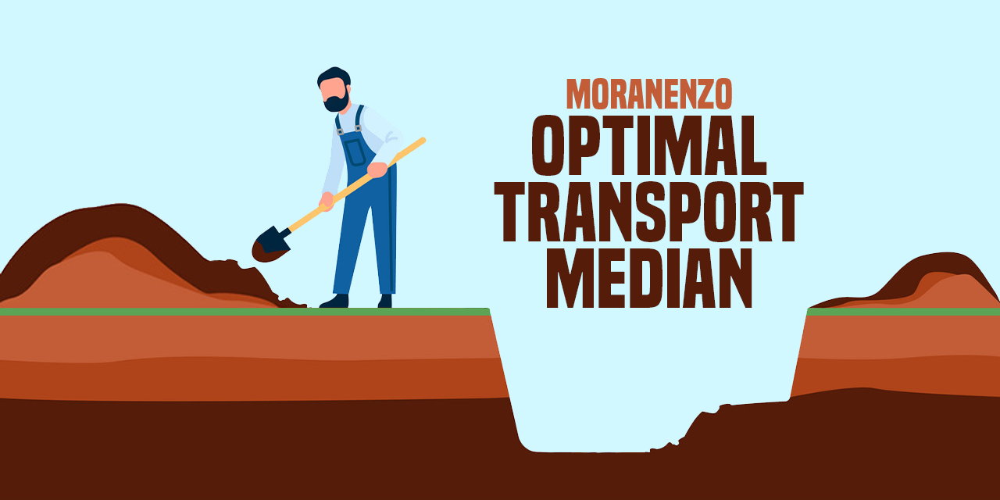
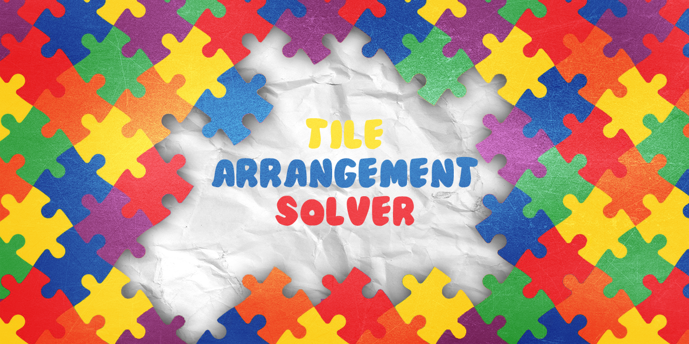

<!-- TITLE -->
<h1 align="left">Enzo Moran</h1>

Hi! I'm Enzo, a second-year student at <a href="https://www.ensae.fr/en">ENSAE Paris</a> who focuses on data science and machine learning. 
Feel free to reach out at <a href="mailto:enzo.moran@ensae.fr">enzo.moran@ensae.fr</a> or connect with me on <a href="https://www.linkedin.com/in/enzo-moran-66b7ba283/">LinkedIn</a>, whether you have a cool project in mind, a question about my work, or just want to chat!

I'm currently working with ENGIE on a gas consumption prediction model. You can take a look <a href="https://github.com/moranenzo/PY-Music-Genre-Classifier" target="_blank">here</a></li>.

Below are projects from both academic work at ENSAE Paris and personal initiatives.

<!-- PROJECTS -->
<h1 align="left">Projects</h1>

  
  <ul>
      <li><strong>What it's about:</strong> Predicting music genres based on audio features from Spotify’s API. Includes models like RandomForest, XGBoost, and CatBoost. 
      <a href="https://github.com/moranenzo/Music-Genre-Classifier" target="_blank">Repo here</a></li>
      <li><strong>Tech stack:</strong> Python, Machine Learning, Data Preprocessing, Spotify API</li>
  </ul>

 

  
  <ul>
      <li><strong>What it's about:</strong> Using optimal transport theory to define a median for multivariate datasets. 
      <a href="https://github.com/moranenzo/Optimal-Transport-Median" target="_blank">Repo here</a></li>
      <li><strong>Tech stack:</strong> Python, Optimal Transport, Data Science, Mathematical Optimization</li>
  </ul>

 

  
  <ul>
      <li><strong>What it's about:</strong> Solving a tile arrangement puzzle using BFS and A* algorithms, with a GUI built in Pygame. 
      <a href="https://github.com/moranenzo/Tile-Arrangement-Solver" target="_blank">Repo here</a></li>
      <li><strong>Tech stack:</strong> Python, Pygame, Algorithms (BFS, A*), Graph Theory</li>
  </ul>

 

  
  <ul>
      <li><strong>What it's about:</strong> Analyzing the gender gap in political support for the radical right using statistical methods. 
      <a href="https://github.com/moranenzo/Radical-Right-Gender-Gap" target="_blank">Repo here</a></li>
      <li><strong>Tech stack:</strong> R, Statistical Analysis, Data Visualization</li>
  </ul>

 

  
  <ul>
      <li><strong>What it's about:</strong> Developing a system for secure data exchange using contactless smart cards and RFID technology.
      <a href="https://github.com/moranenzo/TIPE-Contactless-Smart-Cards" target="_blank">Repo here</a></li>
      <li><strong>Tech stack:</strong> C++, Python, RFID</li>
  </ul>

